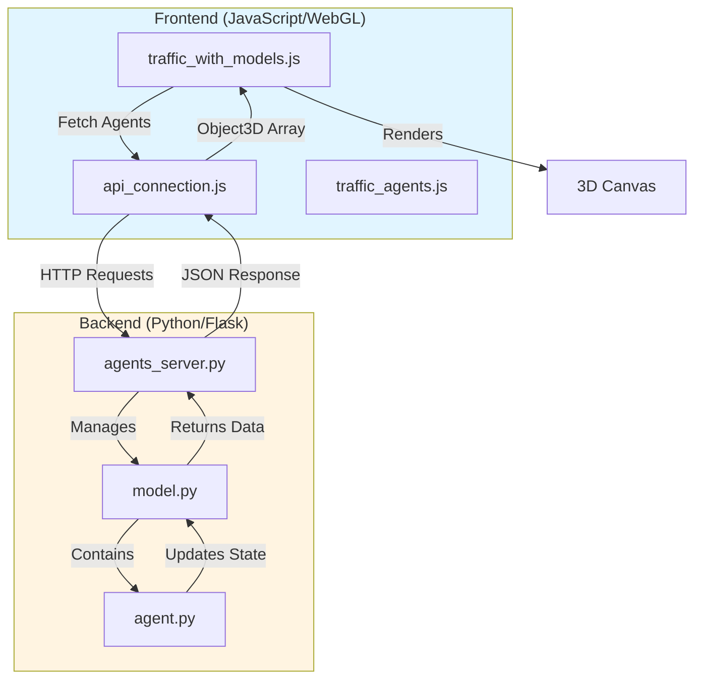
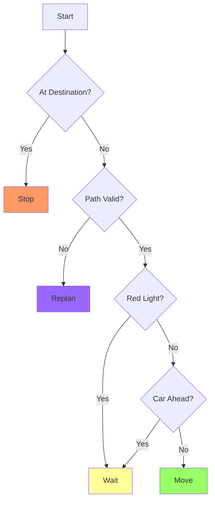
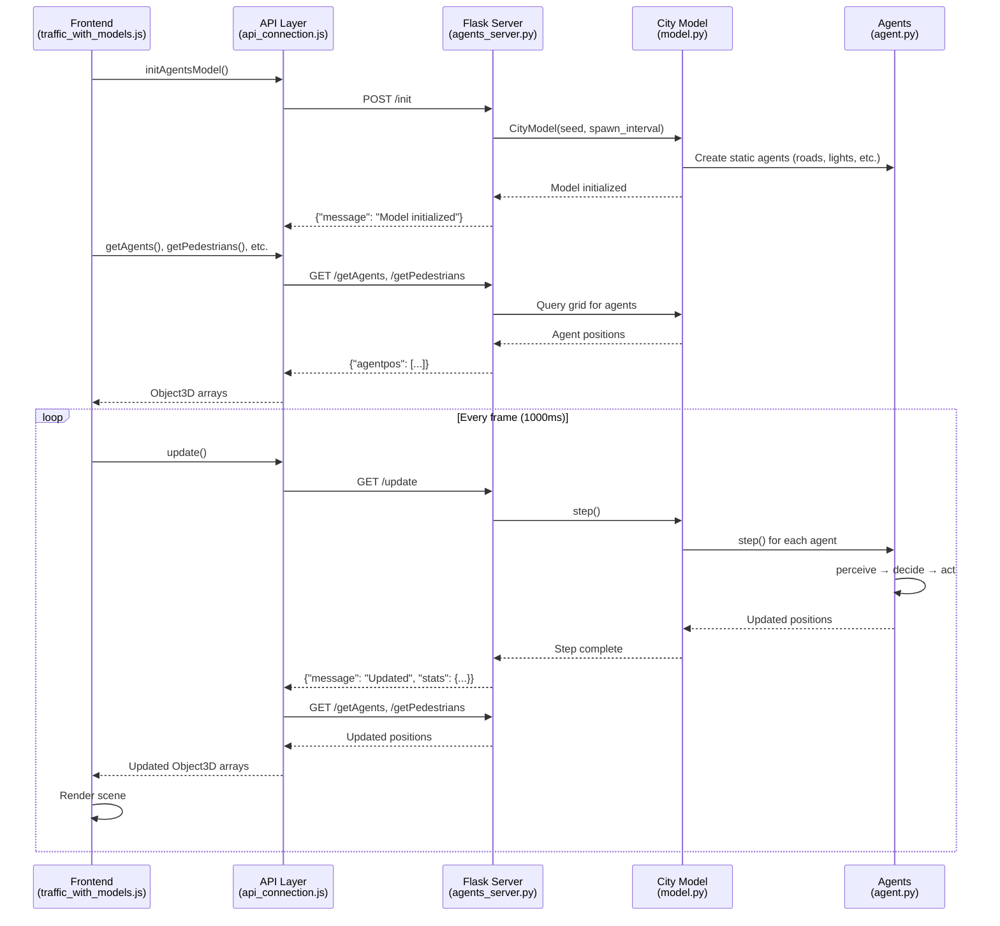
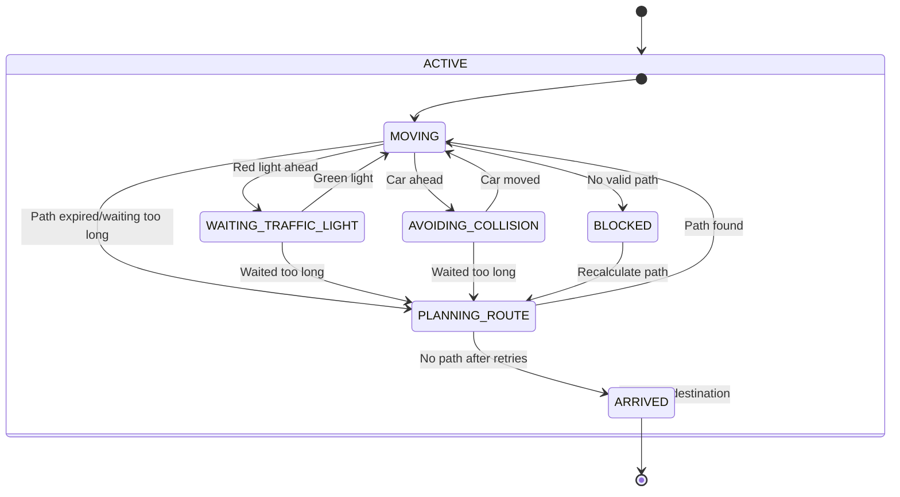
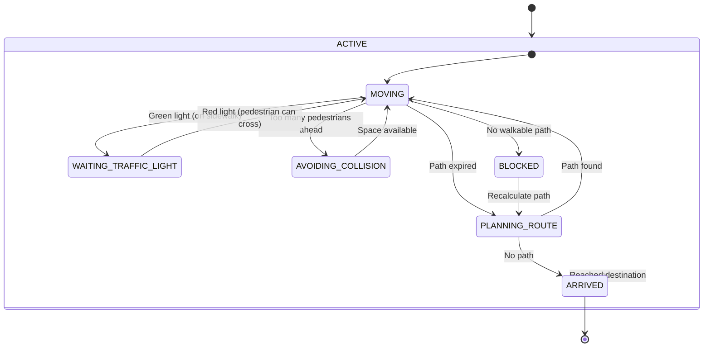

# Traffic Simulation System - Technical Documentation

---

## Table of Contents

1. [Overview](#overview)
2. [System Architecture](#system-architecture)
3. [Backend Components](#backend-components)
4. [Frontend Components](#frontend-components)
5. [API Reference](#api-reference)
6. [Data Flow](#data-flow)
7. [Agent Behaviors](#agent-behaviors)

---

## Overview

This project is a **multi-agent traffic simulation system** that models urban traffic flow with cars, pedestrians, traffic lights, and road infrastructure. The system uses:

- **Backend:** Python with Flask and Mesa framework for agent-based modeling
- **Frontend:** JavaScript with WebGL for 3D visualization
- **Communication:** REST API for real-time data synchronization

---

## System Architecture



---

## Backend Components

### 1. `agents_server.py`

**Purpose:** Flask server that exposes REST API endpoints for the traffic simulation.

**Location:** `AgentsVisualization/Server/trafficServer/agents_server.py`

#### Key Features

- **Port:** 8585
- **CORS Enabled:** Allows requests from `http://localhost`
- **Global State Management:** Maintains the `city_model` and `currentStep`

#### API Endpoints

##### **POST /init**
Initialize the simulation model with custom parameters.

**Request Body:**
```json
{
  "NAgents": 10,
  "seed": 42,
  "spawnInterval": 10
}
```

**Response:**
```json
{
  "message": "Model initialized"
}
```

---

##### **GET /getAgents**
Retrieve all active car agents.

**Response:**
```json
{
  "agentpos": [
    {
      "id": "123",
      "x": 5,
      "y": 1,
      "z": 10,
      "orientation": "Up"
    }
  ]
}
```

---

##### **GET /getPedestrians**
Retrieve all active pedestrian agents.

**Response:**
```json
{
  "Pedestrianpos": [
    {
      "id": "456",
      "x": 3,
      "y": 1,
      "z": 8,
      "orientation": "Right"
    }
  ]
}
```

---

##### **GET /getTrafficLights**
Retrieve all traffic lights with their current states.

**Response:**
```json
{
  "TrafficLightpos": [
    {
      "id": "789",
      "x": 7,
      "y": 1,
      "z": 12,
      "state": true,
      "time_remaining": 5
    }
  ]
}
```

---

##### **GET /getObstacles**
Retrieve all obstacles (buildings).

**Response:**
```json
{
  "obstaclepos": [
    {
      "id": "999",
      "x": 10,
      "y": 1,
      "z": 15
    }
  ]
}
```

---

##### **GET /getRoads**
Retrieve all road tiles.

---

##### **GET /getDestinations**
Retrieve all car destination tiles.

---

##### **GET /getPedestrianDestinations**
Retrieve all pedestrian destination tiles.

---

##### **GET /getSidewalks**
Retrieve all sidewalk tiles.

---

##### **GET /getPedestrianWalks**
Retrieve all pedestrian crossing tiles.

---

##### **POST /setSpawnInterval**
Update the spawn interval for agents.

**Request Body:**
```json
{
  "interval": 15
}
```

---

##### **POST /setPedestriansEnabled**
Enable or disable pedestrian spawning.

**Request Body:**
```json
{
  "enabled": true
}
```

---

##### **POST /reset**
Reset the simulation with new parameters.

**Request Body:**
```json
{
  "seed": 100,
  "spawnInterval": 8,
  "pedestriansEnabled": true
}
```

---

##### **GET /update**
Advance the simulation by one step and return statistics.

**Response:**
```json
{
  "message": "Model updated to step 42",
  "stats": {
    "active_cars": 15,
    "arrived_cars": 8,
    "total_cars": 23,
    "active_pedestrians": 5,
    "arrived_pedestrians": 2,
    "total_pedestrians": 7
  }
}
```

---

### 2. `model.py`

**Purpose:** Defines the `CityModel` class that manages the entire simulation.

**Location:** `AgentsVisualization/Server/trafficServer/trafficAgents/traffic_base/model.py`

#### Class: `CityModel`

**Inheritance:** `mesa.Model`

**Key Attributes:**

| Attribute | Type | Description |
|-----------|------|-------------|
| `grid` | `OrthogonalMooreGrid` | 2D grid representing the city |
| `num_agents` | `int` | Initial number of agents |
| `traffic_lights` | `list` | All traffic light agents |
| `car_destinations` | `list` | All car destination points |
| `pedestrian_destinations` | `list` | All pedestrian destination points |
| `spawn_interval` | `int` | Steps between agent spawns |
| `spawn_timer` | `int` | Current spawn timer |
| `car_spawn_positions` | `list` | Corner positions for car spawning |
| `max_cars` | `int` | Maximum cars (1000) |
| `max_pedestrians` | `int` | Maximum pedestrians (10) |
| `pedestrians_enabled` | `bool` | Whether to spawn pedestrians |

#### Methods

##### `__init__(initial_agents_count, seed=42, spawn_interval=10)`
Initialize the city model by loading the map from file and creating static agents.

**Map File:** `city_files/2025_base.txt`

**Map Legend:**
- `v`, `^`, `>`, `<`: Roads with direction
- `S`, `s`: Traffic lights (green/red)
- `#`: Obstacles (buildings)
- `D`: Car destinations
- `P`: Pedestrian destinations
- `B`: Sidewalks
- `C`: Pedestrian crossings

---

##### `_detect_road_direction_from_neighbors(column_index, row_index, map_lines, row_content, map_character_dictionary)`
Detects the direction of a road tile by checking neighboring road characters.

---

##### `set_spawn_interval(interval)`
Updates the spawn interval to control agent generation frequency.

---

##### `set_pedestrians_enabled(enabled)`
Enables or disables pedestrian spawning.

---

##### `step()`
Advances the simulation by one step:
1. Updates all agents (cars, pedestrians, traffic lights)
2. Increments spawn timer
3. Spawns new cars at corner positions if conditions are met
4. Spawns new pedestrians at random destinations
5. Checks for blocked spawn conditions

---

### 3. `agent.py`

**Purpose:** Defines all agent types in the simulation.

**Location:** `AgentsVisualization/Server/trafficServer/trafficAgents/traffic_base/agent.py`

#### Enumerations

##### `MainState`
```python
class MainState(Enum):
    ACTIVE = "active"
    ARRIVED = "arrived"
```

##### `NavigatingState`
```python
class NavigatingState(Enum):
    MOVING = "moving"
    WAITING_TRAFFIC_LIGHT = "waiting"
    AVOIDING_COLLISION = "avoiding"
    BLOCKED = "blocked"
    PLANNING_ROUTE = "planning"
```

---

#### Class: `Car`

**Inheritance:** `mesa.experimental.cell_space.CellAgent`

**Description:** Intelligent car agent with A* pathfinding and state machine behavior.

**Key Attributes:**

| Attribute | Type | Description |
|-----------|------|-------------|
| `destination` | `Destination` | Target destination |
| `main_state` | `MainState` | Active or Arrived |
| `navigating_state` | `NavigatingState` | Current navigation state |
| `orientation` | `str` | "Up", "Down", "Left", "Right" |
| `path` | `list` | Calculated A* path |
| `path_index` | `int` | Current position in path |
| `waiting_time` | `int` | Steps spent waiting |
| `congestion_weight` | `float` | 2.0-8.0, affects route planning |
| `path_randomness` | `float` | 0.0-3.0, adds diversity to paths |

**Key Methods:**

##### `calculate_path_to_destination()`
Uses **A* algorithm** to find the optimal path to the destination.

**Features:**
- Respects one-way roads
- Avoids congested cells (uses `congestion_weight`)
- Adds randomness for path diversity
- Blocks cells containing other cars' destinations

**Returns:** `bool` - True if path found

---

##### `get_valid_neighbors(cell)`
Returns valid neighboring cells respecting road directions and avoiding occupied destinations.

---

##### `get_movement_cost(cell)`
Calculates dynamic movement cost based on:
- Base cost: 1.0
- Congestion: `cars_in_cell * congestion_weight`
- Randomness: `random(0, path_randomness)`

---

##### `perceive_environment()`
Returns a perception dictionary:
```python
{
    'road': Road agent or None,
    'traffic_light': Traffic_Light agent or None,
    'cars_ahead': [Car agents],
    'next_cell': Cell object or None
}
```

---

##### `decide_action(perception)`
Implements state machine decision logic:



**Returns:** `str` - 'move', 'wait', 'replan', or 'stop'

---

##### `execute_action(action, perception)`
Executes the decided action:
- **'move':** Updates `cell`, `orientation`, advances `path_index`
- **'wait':** Increments `waiting_time`
- **'replan':** Recalculates path, tries alternative destinations if failed
- **'stop':** Transitions to ARRIVED state and removes agent

---

##### `step()`
Main agent loop: `perceive → decide → act`

---

#### Class: `Pedestrian`

**Inheritance:** `mesa.experimental.cell_space.CellAgent`

**Description:** Pedestrian agent with A* pathfinding for sidewalks and crossings.

**Key Attributes:**

Similar to `Car`, but navigates on:
- Sidewalks (`Sidewalk` agents)
- Pedestrian crossings (`PedestrianWalk` agents)
- Traffic lights (`Traffic_Light` agents)

**Additional Attribute:**
- `is_crossing` (`bool`): Whether currently on a pedestrian crossing

---

**Key Differences from Cars:**

1. **Movement Rules:**
   - Can walk on sidewalks, crossings, and traffic lights
   - Waits for cars when **NOT** crossing (obeys traffic lights inversely)
   - Allows up to **4 pedestrians** per cell (collision avoidance)

2. **Traffic Light Behavior:**
   - **On Sidewalk:** Waits when traffic light is GREEN (cars can pass)
   - **On Crossing:** Can move regardless of light (pedestrian priority)

3. **Pathfinding:**
   - No directional constraints (can move in all 4 directions)
   - No congestion-based cost calculation

---

#### Static Agents

##### `Road(FixedAgent)`
- **Attribute:** `direction` (str): "Up", "Down", "Left", "Right"

##### `Traffic_Light(FixedAgent)`
- **Attributes:**
  - `state` (bool): True = Green, False = Red
  - `time_remaining` (int): Steps until state change
  - `timeToChange` (int): Total duration of state

##### `Obstacle(FixedAgent)`
Buildings and impassable areas.

##### `Destination(FixedAgent)`
Car destination points.

##### `Sidewalk(FixedAgent)`
Pedestrian walkways.

##### `PedestrianWalk(FixedAgent)`
Pedestrian crossings (zebra crossings).

---

## Frontend Components

### 1. `api_connection.js`

**Purpose:** Manages all communication with the Flask server.

**Location:** `AgentsVisualization/libs/api_connection.js`

#### Global Arrays

```javascript
agents = []          // Car Object3D instances
pedestrians = []     // Pedestrian Object3D instances
obstacles = []       // Building Object3D instances
trafficLights = []   // Traffic light Object3D instances
roads = []           // Road Object3D instances
destinations = []    // Destination Object3D instances
sidewalks = []       // Sidewalk Object3D instances
pedestrianWalks = [] // Crossing Object3D instances
pedestrianDestinations = [] // Pedestrian destination Object3D instances
```

#### Configuration

```javascript
const agent_server_uri = "http://localhost:8585/";

const initData = {
    NAgents: 20,
    width: 30,
    height: 30,
    seed: 42,
    spawnInterval: 10
};

const simulationSettings = {
    spawnInterval: 10,
    pedestriansEnabled: true,
    seed: 42
};
```

#### Key Functions

##### `async initAgentsModel()`
Initializes the simulation by sending a POST request to `/init`.

---

##### `async getAgents()`
Fetches car positions and updates the `agents` array.

**Features:**
- Creates new `Object3D` instances for new cars
- Updates positions for existing cars
- Stores `prevPosition` for smooth interpolation
- Removes cars no longer in server response

---

##### `async getPedestrians()`
Fetches pedestrian positions and updates the `pedestrians` array.

**Similar Logic:** Creates, updates, and removes pedestrian Object3D instances.

---

##### `async getTrafficLights()`
Fetches traffic light states and updates `trafficLights` array.

**Updates:** Only the `state` property for existing lights.

---

##### `async getObstacles()`
Fetches obstacles (called once during initialization).

---

##### `async getRoads()`, `async getDestinations()`, `async getSidewalks()`, `async getPedestrianWalks()`, `async getPedestrianDestinations()`
Fetch static environment elements (called once).

---

##### `async setSpawnInterval(interval)`
Updates spawn interval on server and locally.

---

##### `async setPedestriansEnabled(enabled)`
Enables/disables pedestrian spawning.

---

##### `async resetSimulation(seed = null)`
Resets the simulation and clears local arrays.

---

##### `async update()`
Advances simulation by one step and fetches updated positions.

**Called Every Frame:**
```javascript
await getAgents();
await getPedestrians();
await getTrafficLights();
```

---

### 2. `traffic_with_models.js`

**Purpose:** Main 3D visualization using WebGL and TWGL.

**Location:** `AgentsVisualization/visualization/traffic_with_models.js`

#### Technologies Used

- **WebGL 2.0:** Low-level graphics API
- **TWGL:** WebGL helper library
- **lil-gui:** UI controls
- **Custom 3D Library:** Camera, Scene, Object3D classes

#### Global Variables

```javascript
const scene = new Scene3D();
let colorProgramInfo;      // Shader program for colored objects
let textureProgramInfo;    // Shader program for textured objects
let skyboxProgramInfo;     // Shader program for skybox
const duration = 1000;     // ms per simulation step
```

#### Settings Object

```javascript
const settings = {
    spawnRate: 10,
    pedestriansEnabled: true,
    seed: 42,
    rotationSpeed: { x: 0, y: 0, z: 0 },
    camera: {
        distance: 27.4,
        azimuth: 1.98,
        elevation: 1.27,
        targetX: 20.0,
        targetY: -3.0,
        targetZ: 10.0
    },
    resetSimulation: async function() { ... },
    togglePedestrians: async function() { ... }
};
```

#### Geometry Storage

**Cars:**
```javascript
const agentGeometry = {
    arrays: null,
    bufferInfo: null,
    vao: null  // Vertex Array Object
};
```

**Wheels:**
```javascript
const wheelGeometry = {
    arrays: null,
    bufferInfo: null,
    vao: null,
    textureVao: null,
    texture: null  // Mazda rim texture
};
```

**Pedestrians:**
```javascript
const pedestrianGeometry = {
    model1: { arrays, bufferInfo, vao },  // persona1.obj
    model2: { arrays, bufferInfo, vao },  // persona2.obj
    texture: null  // Steve skin texture
};
```

**Buildings:**
```javascript
const buildingGeometries = [
    { arrays, bufferInfo, vao, scale: 0.5 },
    // ... 9 different building models
];
```

---

#### Key Functions

##### `async main()`
Main initialization function:

1. **Setup Canvas & WebGL**
   ```javascript
   const canvas = document.querySelector('canvas');
   gl = canvas.getContext('webgl2');
   ```

2. **Compile Shaders**
   - Phong shading for colored models
   - Texture shading for textured models
   - Skybox flat shading

3. **Load 3D Models**
   - Car model (car-2024-301.obj)
   - Wheel model (wheel.obj)
   - Pedestrian models (persona1.obj, persona2.obj)
   - 9 building models
   - Bulb geometry for traffic lights

4. **Load Textures**
   - Wheel texture (Mazda rim)
   - Pedestrian texture (Minecraft Steve skin)
   - Road textures (asphalt, sidewalk, crossings)
   - Skybox texture

5. **Initialize Simulation**
   ```javascript
   await initAgentsModel();
   await getAgents();
   await getObstacles();
   // ... get all static elements
   ```

6. **Setup Scene & Start Render Loop**
   ```javascript
   setupScene();
   setupObjects(scene, gl, colorProgramInfo);
   setupUI();
   drawScene();
   ```

---

##### `function interpolatePosition(prevPos, currentPos, t)`
Smooth agent movement using **SmoothStep easing**.

**Formula:**
```
t_smooth = t² × (3 - 2t)
position = prevPos + t_smooth × (currentPos - prevPos)
```

**Parameters:**
- `prevPos`: Previous position { x, y, z }
- `currentPos`: Current position { x, y, z }
- `t`: Interpolation factor [0, 1]

**Returns:** `[x, y, z]` interpolated position

---

##### `async function setupObjects(scene, gl, programInfo)`
Creates visual representations for all agents and environment elements.

**Cars:**
- Uses car model geometry
- Scale: 0.2
- White color (vertex colors from MTL file show through)
- Adds 4 wheels per car (front/back, left/right)

**Wheels:**
- Uses wheel model with Mazda texture
- Dynamic rotation based on movement
- Steering angle for front wheels during turns

**Pedestrians:**
- Alternates between persona1 and persona2 models (walking animation)
- Uses Steve texture (Minecraft style)
- Scale: 0.05
- Y offset: 0.5 (base touches ground)

**Buildings:**
- Random building model selection (deterministic based on position)
- Various scales (0.5 - 1.25)

**Roads, Sidewalks, Crossings:**
- Textured cubes with appropriate textures
- Roads: Asphalt texture
- Sidewalks: Concrete texture
- Crossings: Zebra crossing texture with orientation detection

**Traffic Lights:**
- Grouped into pairs (one pole per pair)
- Pole: Dark gray cube (scale: 0.04 x 0.8 x 0.04)
- Bulbs: Colored based on state (red/green)

**Skybox:**
- Large cube (scale: 50x50x50)
- Sky texture applied

---

##### `function updateSceneAgents()`
Manages dynamic car agents:

1. **Add New Cars:**
   - Checks if car exists in scene
   - Creates Object3D with car geometry
   - Initializes wheel rotation and steering

2. **Update Existing Cars:**
   - Tracks orientation changes
   - Calculates steering angle for turns
   - Updates wheel rotation based on movement

3. **Remove Inactive Cars:**
   - Filters scene.objects to remove cars no longer in API response

---

##### `function checkForNewPedestrians()`
Manages dynamic pedestrian agents (similar logic to cars).

---

##### `function getRotationFromOrientation(orientation)`
Converts orientation string to rotation angle (radians).

**Car Model Default:** Faces EAST

| Orientation | Rotation | Radians |
|-------------|----------|---------|
| "Up" | -90° | -π/2 |
| "Down" | 90° | π/2 |
| "Left" | 180° | π |
| "Right" | 0° | 0 |

---

##### `function calculateTurnAngle(prevOrientation, newOrientation)`
Calculates steering angle for front wheels based on turn direction.

**Max Steering Angle:** 30° (π/6)

**Returns:**
- Positive: Turning left
- Negative: Turning right
- Zero: Going straight

---

##### `async function drawScene()`
Main render loop (called every frame):

1. **Calculate Time Delta**
   ```javascript
   let deltaTime = now - then;
   elapsed += deltaTime;
   let fract = Math.min(1.0, elapsed / duration);
   ```

2. **Clear Canvas**
   ```javascript
   gl.clearColor(0.529, 0.808, 0.922, 1); // Sky blue
   gl.clear(gl.COLOR_BUFFER_BIT | gl.DEPTH_BUFFER_BIT);
   ```

3. **Render Skybox** (drawn first, behind everything)

4. **Render Objects** (color program)
   - For each object:
     - Calculate transformation matrix (scale → rotate → translate)
     - Apply camera transformation (World-View-Projection)
     - Draw using VAO and bufferInfo

5. **Render Textured Objects** (texture program)
   - Roads, sidewalks, crossings, wheels, pedestrians

6. **Render Traffic Light Bulbs** (color program)
   - Position based on light state
   - Color: red (state=false) or green (state=true)

7. **Render Wheels for Each Car** (texture program)
   - 4 wheels per car with dynamic rotation and steering

8. **Render Pedestrians with Animation** (texture program)
   - Alternates models based on elapsed time for walking effect

9. **Update Simulation** (every `duration` ms)
   ```javascript
   if (elapsed >= duration) {
       elapsed = 0;
       await update();  // Call API to advance simulation
       updateSceneAgents();
       checkForNewPedestrians();
   }
   ```

10. **Request Next Frame**
    ```javascript
    requestAnimationFrame(drawScene);
    ```

---

##### `function groupTrafficLights()`
Groups adjacent traffic lights to share one pole.

**Logic:**
- Looks for pairs within 1 cell distance
- Positions pole at midpoint between lights
- Reduces visual clutter

---

### 3. `traffic_agents.js`

**Purpose:** Simplified version of `traffic_with_models.js` (basic cubes instead of 3D models).

**Location:** `AgentsVisualization/visualization/traffic_agents.js`

**Key Differences:**
- Uses simple colored cubes for all objects
- No texture support
- No 3D model loading
- Lighter and faster for testing

**Use Case:** Debugging and performance testing without model complexity.

---

## API Reference

### Base URL
```
http://localhost:8585
```

### Endpoints Summary

| Method | Endpoint | Description |
|--------|----------|-------------|
| POST | `/init` | Initialize simulation |
| POST | `/reset` | Reset simulation |
| POST | `/setSpawnInterval` | Update spawn rate |
| POST | `/setPedestriansEnabled` | Toggle pedestrians |
| GET | `/update` | Advance simulation step |
| GET | `/getAgents` | Fetch car positions |
| GET | `/getPedestrians` | Fetch pedestrian positions |
| GET | `/getTrafficLights` | Fetch traffic light states |
| GET | `/getObstacles` | Fetch buildings |
| GET | `/getRoads` | Fetch road tiles |
| GET | `/getDestinations` | Fetch car destinations |
| GET | `/getPedestrianDestinations` | Fetch pedestrian destinations |
| GET | `/getSidewalks` | Fetch sidewalks |
| GET | `/getPedestrianWalks` | Fetch crossings |

---

## Data Flow



---

## Agent Behaviors

### Car Agent State Machine



### Pedestrian Agent State Machine



---

## Key Algorithms

### A* Pathfinding

**Used By:** `Car` and `Pedestrian` agents

**Pseudocode:**
```python
def calculate_path_to_destination():
    open_set = priority_queue([start])  # Sorted by f_score
    came_from = {}
    g_score = {start: 0}  # Cost from start
    f_score = {start: heuristic(start, goal)}  # Estimated total cost
    
    while open_set:
        current = open_set.pop_min()
        
        if current == goal:
            return reconstruct_path(came_from, current)
        
        for neighbor in get_valid_neighbors(current):
            tentative_g = g_score[current] + movement_cost(neighbor)
            
            if neighbor not in g_score or tentative_g < g_score[neighbor]:
                came_from[neighbor] = current
                g_score[neighbor] = tentative_g
                f_score[neighbor] = tentative_g + heuristic(neighbor, goal)
                open_set.add(neighbor)
    
    return []  # No path found
```

**Car-Specific Features:**
- `movement_cost(cell)` = 1.0 + (cars_in_cell × congestion_weight) + random(0, path_randomness)
- Respects one-way road directions
- Avoids cells with other cars' destinations

**Pedestrian-Specific Features:**
- `movement_cost(cell)` = 1.0 (constant)
- Can move in all 4 directions
- Only travels on sidewalks, crossings, and traffic lights

---

## Performance Optimizations

1. **Geometry Reuse:**
   - All cars share the same car geometry (VAO, bufferInfo)
   - All buildings use 9 pre-loaded models (deterministic selection)
   - All wheels share the same wheel geometry

2. **Smart Updates:**
   - Only traffic light states update every frame (not positions)
   - Obstacles, roads, sidewalks fetched once during init

3. **Traffic Light Grouping:**
   - Adjacent lights share one pole (reduces draw calls)

4. **Agent Removal:**
   - Agents removed from grid when arrived (not just marked inactive)
   - Frontend removes Object3D instances when agents disappear

5. **Smooth Interpolation:**
   - Visual positions interpolated between server updates
   - Reduces perceived lag and stuttering

---

## Configuration Files

### Map Dictionary (`mapDictionary.json`)

```json
{
  "v": "Down",
  "^": "Up",
  ">": "Right",
  "<": "Left",
  "S": "10",
  "s": "10"
}
```

### City Map (`2025_base.txt`)

Text file with ASCII characters representing the city layout:
- `v`, `^`, `>`, `<`: Roads
- `S`, `s`: Traffic lights
- `#`: Buildings
- `D`: Car destinations
- `P`: Pedestrian destinations
- `B`: Sidewalks
- `C`: Crossings

---

## Development Notes

### Running the System

1. **Start Backend:**
   ```bash
   cd AgentsVisualization/Server/trafficServer
   python agents_server.py
   ```

2. **Start Frontend:**
   ```bash
   cd AgentsVisualization/visualization
   # Use a local server (e.g., Live Server extension)
   ```

3. **Access:**
   - Frontend: `http://localhost:<port>/visualization/index.html`
   - Backend: `http://localhost:8585`

---

### Dependencies

**Backend:**
- Flask
- Flask-CORS
- Mesa (experimental branch)

**Frontend:**
- TWGL
- lil-gui
- Custom 3D library (3d-lib, scene3d, object3d, camera3d, obj_loader, light3d)

---

### Known Limitations

1. **Max Agents:**
   - Cars: 1000
   - Pedestrians: 10

2. **Spawn Blocking:**
   - Simulation stops if all spawn points blocked for 3 consecutive attempts

3. **Pedestrian Density:**
   - Max 4 pedestrians per cell (prevents overcrowding)

4. **Path Failures:**
   - Cars removed after 3 failed pathfinding attempts

---

### Future Enhancements

1. **Dynamic Traffic Light Timing:** Adjust based on traffic flow
2. **Bus Agents:** Public transportation with fixed routes
3. **Parking Zones:** Cars can park and spawn new drivers
4. **Weather Effects:** Rain/fog affecting visibility and speeds
5. **Accident Simulation:** Random events blocking roads

---

## Glossary

| Term | Definition |
|------|------------|
| **Agent** | Autonomous entity in the simulation (car, pedestrian, traffic light) |
| **Mesa** | Python framework for agent-based modeling |
| **TWGL** | Tiny WebGL library for easier WebGL usage |
| **VAO** | Vertex Array Object - stores vertex attribute configuration |
| **Buffer Info** | WebGL buffer data (vertices, normals, colors, UVs) |
| **Object3D** | Custom class representing a 3D object with position, rotation, scale |
| **Cell** | Grid position in the city model |
| **A*** | Pathfinding algorithm (A-star) |
| **Heuristic** | Estimate of remaining distance to goal (Manhattan distance) |
| **SmoothStep** | Easing function for smooth interpolation: t²(3-2t) |

---

## Contact & Support

**Team:** Redstone  
**Classroom:** 301  
**Year:** 2025

For questions or issues, refer to the project repository or contact the development team.

---

*End of Documentation*
